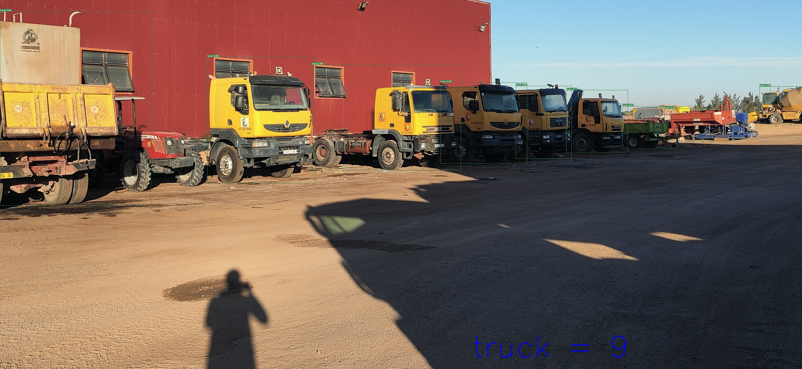
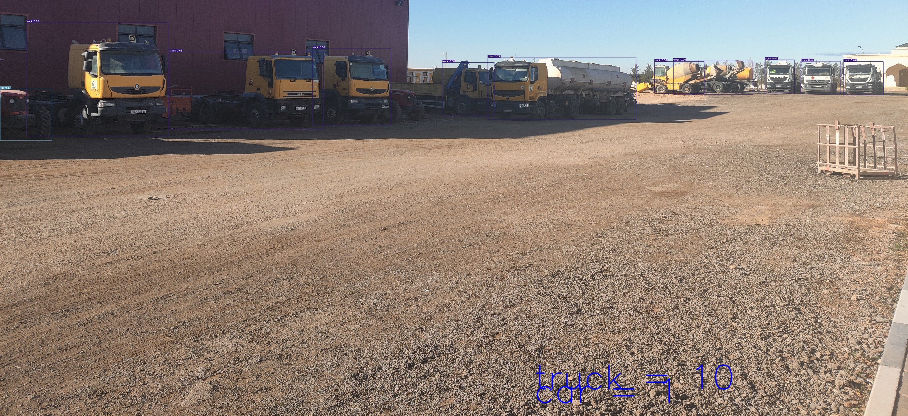

# Trying YOLOv7
Hey all this's my first try using YOLOv7  
I find it really awesome , i added something little is by counting number of each object detected

```
def count(founded_classes,im0):
  model_values=[]
  aligns=im0.shape
  align_bottom=aligns[0]
  align_right=(aligns[1]/1.7 ) 

  for i, (k, v) in enumerate(founded_classes.items()):
    label_string=f"{k} = {v}"
    model_values.append(v)
    align_bottom=align_bottom-60                                                   
    cv2.putText(im0, str(label_string) ,(int(align_right),align_bottom), cv2.FONT_HERSHEY_SIMPLEX, 5,(255, 0, 0),3,cv2.LINE_AA)
  

```  
In the ligne 129 i add some code to show the text in the image/frame
```
if len(det):
                # Rescale boxes from img_size to im0 size
                det[:, :4] = scale_coords(img.shape[2:], det[:, :4], im0.shape).round()

                founded_classes={} #Les classes trouver
                # Print results
                for c in det[:, -1].unique():
                    n = (det[:, -1] == c).sum()  # detections per class
                    class_index=int(c) #index of the class
                    count_of_object=int(n) #number of object found in n class
                    
                    founded_classes[names[class_index]]=int(n) #return the name of the class
                    s += f"{n} {names[int(c)]}{'s' * (n > 1)}, "  # add to string
                    count(founded_classes=founded_classes,im0=im0)  # apply our function "count"

```

## How to use it

### Importing YOLOv7
```
!git clone https://github.com/WongKinYiu/yolov7
```  
### Download the weigths of YOLOv5
```
!wget https://github.com/WongKinYiu/yolov7/releases/download/v0.1/yolov7.pt
```  
### To use YOLOv5  
we execute this ligne and 2 3 7 is to specify the classes 'car, truck , motorcycle' 
``` shell
!python detect.py --weights yolov7.pt --classes 2 3 7 --source /YOLO_DataTesting/Video_DTC.mp4
```

and this to show you the count of every object by class:
``` shell
!python detect_count.py --weights yolov7.pt --classes 2 3 7 --source /YOLO_DataTesting/IMG_20221221_085432.jpg
```


## Results  
### Images
<div align="center">
    <a href="./">
        
    </a>
</div>
<div align="center">
    <a href="./">
        
    </a>
</div>
  
### Video  
Depuis Mon Drive (Video)[https://drive.google.com/file/d/1-1dumXjzqIdA6GLP8XZKjH-GA5eodH82/view?usp=share_link]
